# LAPORAN PRAKTIKUM MINGGU 5
## Local Storage & Offline-First — Offline Notes

### Identitas

- **Nama:** Fata Haidar Aly
- **NIM:** 244107020108
- **Kelas:** TI-3C
- **Repository:** https://github.com/Fata-Haidar/244107020108-mobile-course/tree/main/week5_offline_notes

---

## 1. Tujuan Praktikum

Praktikum Minggu 5 bertujuan membangun aplikasi **Offline Notes** yang mampu menyimpan preferensi pengguna, melakukan CRUD catatan secara lokal, tetap berfungsi ketika perangkat offline, menggunakan cache untuk data dari API, melakukan simulasi sinkronisasi, serta menguji logika aplikasi tanpa bergantung pada database asli.

Teknologi utama yang digunakan:

- Flutter dan Dart
- Riverpod
- SharedPreferences
- SQLite / sqflite
- Dio
- GoRouter

Alur data utama aplikasi:

```text
UI → Provider → Repository → Local Storage / Remote Data
```

---

# 2. Praktikum 1 — SharedPreferences

## 2.1 Tujuan

Praktikum 1 digunakan untuk menyimpan preferensi sederhana menggunakan `SharedPreferences`, yaitu:

- pilihan tema terang/gelap;
- waktu terakhir aplikasi dibuka.

Akses `SharedPreferences` dilakukan melalui repository dan provider sehingga halaman UI tidak mengakses penyimpanan secara langsung.

## 2.2 Hasil Aktual

Pengujian menunjukkan bahwa tema dapat diubah dari halaman **Pengaturan** dan perubahan tema dapat diterapkan pada aplikasi.

### Tema Gelap

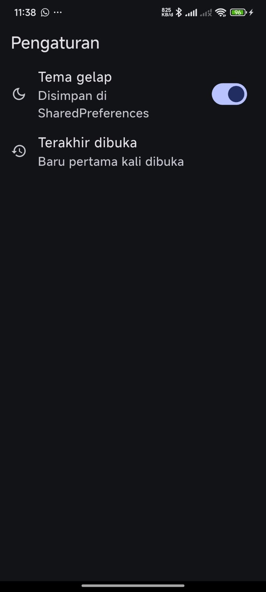

### Tema Terang

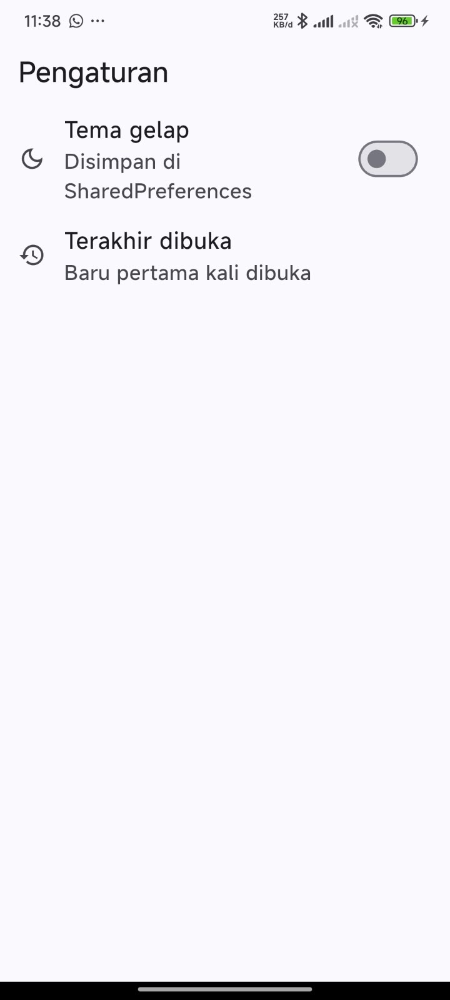

Hasil aktual:

- Toggle tema berhasil mengubah tampilan aplikasi.
- Nilai tema disimpan melalui `SharedPreferences`.
- Informasi terakhir dibuka ditampilkan pada halaman pengaturan.

## 2.3 Jawaban Pertanyaan Praktikum 1

### 1. Mengapa `SharedPreferences.getInstance()` tidak boleh dipanggil di dalam `build()`?

Method `build()` dapat dipanggil berkali-kali setiap widget mengalami rebuild. Jika `SharedPreferences.getInstance()` dipanggil di dalam `build()`, operasi asynchronous dapat dilakukan berulang kali, membuat kode kurang efisien, berpotensi menyebabkan tampilan berkedip, dan lebih sulit diuji. Karena itu akses penyimpanan diletakkan pada repository dan provider.

### 2. Jelaskan alur data saat switch tema ditekan.

Alurnya:

```text
Switch ditekan
→ darkModeProvider.notifier.toggle()
→ state diubah
→ MaterialApp melakukan rebuild
→ tema berubah
→ PrefsRepository menyimpan nilai ke SharedPreferences
```

Ketika aplikasi dibuka kembali, provider membaca nilai tema yang telah tersimpan.

### 3. Apa kelebihan dan risiko optimistic update?

Kelebihannya adalah UI terasa lebih cepat karena tampilan langsung berubah tanpa menunggu proses penyimpanan selesai. Risikonya adalah UI dapat sementara menampilkan nilai baru walaupun penyimpanan sebenarnya gagal. Karena itu diperlukan rollback pada blok `catch`.

---

# 3. Praktikum 2 — Model dan Database SQLite

## 3.1 Tujuan

Praktikum 2 berfokus pada penyimpanan catatan menggunakan SQLite. Data catatan tidak disimpan di `SharedPreferences` karena membutuhkan CRUD, pengurutan, pencarian berdasarkan ID, dan status sinkronisasi.

Struktur data utama:

```text
notes
├── id
├── title
├── body
├── updated_at
└── dirty
```

`NoteRepository` menjadi satu-satunya pintu akses data catatan.

## 3.2 Implementasi

Fungsi utama repository yang digunakan:

- `fetchNotes()` — membaca semua catatan.
- `getNoteById()` — membaca catatan berdasarkan ID.
- `addNote()` — menambah catatan.
- `updateNote()` — memperbarui catatan.
- `deleteNote()` — menghapus catatan.
- `countDirty()` — menghitung catatan yang belum tersinkron.
- `markAllSynced()` — menandai catatan telah tersinkron.

Daftar catatan diurutkan berdasarkan `updated_at DESC`, sehingga catatan terbaru tampil di bagian atas.

## 3.3 Hasil Aktual

Kode berhasil dianalisis tanpa issue menggunakan:

```bash
flutter analyze
```

Hasil aktual yang diperoleh:

```text
No issues found!
```

Tidak terdapat screenshot khusus Praktikum 2 di folder `screenshots`; validasi Praktikum 2 dilakukan melalui hasil analisis kode dan keberhasilan CRUD pada Praktikum 3.

## 3.4 Jawaban Pertanyaan Praktikum 2

### 1. Mengapa kolom `dirty` bertipe INTEGER?

SQLite tidak memiliki tipe Boolean asli seperti pada Dart. Nilai status disimpan menggunakan angka:

```text
0 = false
1 = true
```

Kemudian nilainya dikonversi kembali pada `toMap()` dan `fromMap()`.

### 2. Apa fungsi parameter `openDb` pada constructor `NoteRepository`?

Parameter tersebut digunakan untuk dependency injection. Dengan cara ini repository dapat menerima database atau fungsi pembuka database lain ketika testing sehingga test tidak harus menggunakan SQLite asli.

### 3. Mengapa menggunakan `where: 'id = ?'` dan `whereArgs`?

Karena nilai parameter dipisahkan dari query SQL. Cara ini lebih aman terhadap SQL injection dan menghindari masalah escaping karakter khusus.

### 4. Apa yang terjadi jika menambah kolom di `onCreate` tanpa menaikkan version?

Database lama sudah terlanjur dibuat sehingga `onCreate` tidak dijalankan kembali. Akibatnya kolom baru tidak muncul dan dapat terjadi error seperti `no such column`. Solusinya adalah menaikkan versi database dan membuat migrasi melalui `onUpgrade`.

---

# 4. Praktikum 3 — CRUD Catatan Offline dengan Riverpod

## 4.1 Tujuan

Praktikum 3 menghubungkan `NoteRepository` dengan UI menggunakan Riverpod serta menyediakan operasi:

- Create
- Read
- Update
- Delete

Aplikasi menangani state loading, error, empty, dan success.

## 4.2 Hasil Aktual CRUD

### Tambah Catatan

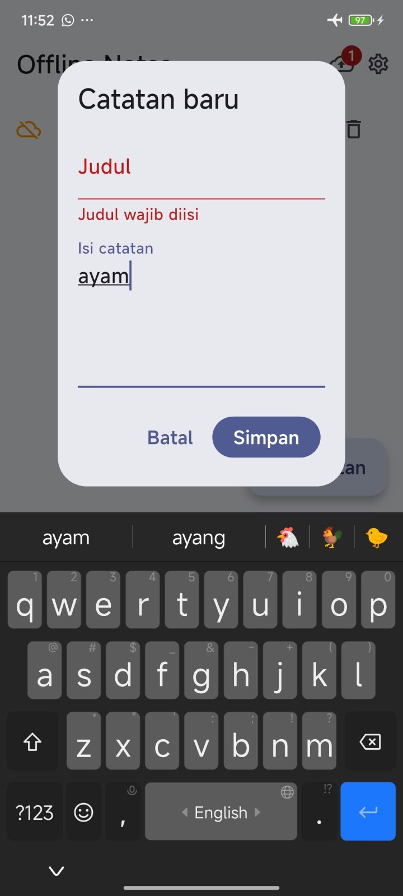

Catatan baru berhasil ditambahkan melalui form. Catatan baru otomatis memiliki `dirty = true`.

### Ubah Catatan

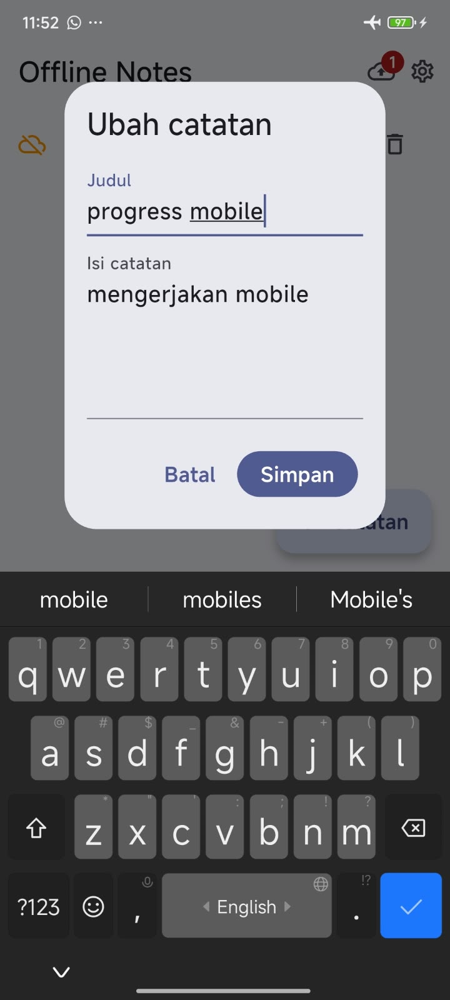

Isi catatan berhasil diperbarui dan waktu `updated_at` ikut diperbarui.

### Hapus Catatan

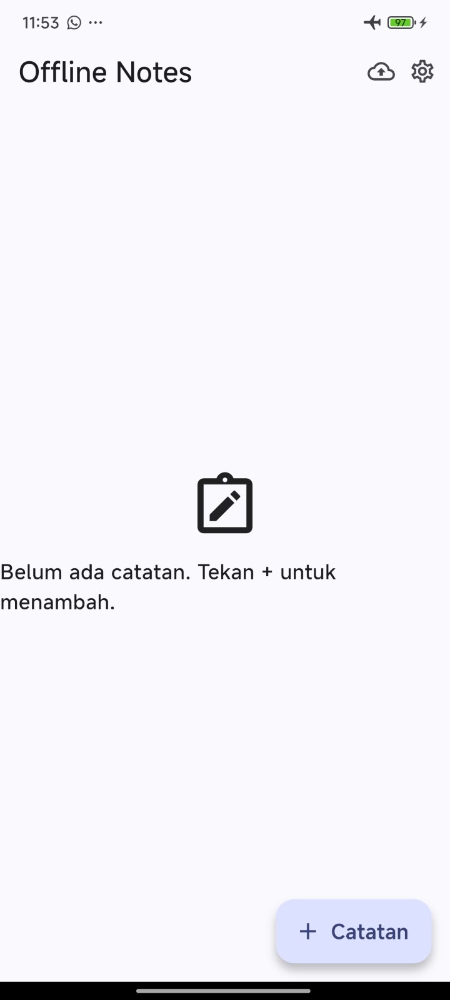

Catatan berhasil dihapus dari SQLite dan daftar pada UI ikut diperbarui.

## 4.3 Tabel Uji Praktikum 3

| No | Skenario | Langkah Pengujian | Hasil Aktual | Status |
|---|---|---|---|---|
| 1 | Empty state | Menjalankan aplikasi ketika belum ada catatan | Tampilan empty state muncul | Lulus |
| 2 | Create | Menekan tombol tambah lalu menyimpan catatan | Catatan baru muncul pada daftar | Lulus |
| 3 | Validasi | Mencoba menyimpan judul kosong | Form menolak penyimpanan judul kosong | Lulus |
| 4 | Update | Membuka dan mengubah isi catatan | Perubahan tersimpan dan catatan diperbarui | Lulus |
| 5 | Delete | Menekan tombol hapus | Catatan hilang dari daftar | Lulus |
| 6 | Persistensi | Menutup dan membuka kembali aplikasi | Catatan tetap tersimpan di SQLite | Lulus |
| 7 | Offline | Melakukan CRUD tanpa mengandalkan jaringan | CRUD catatan tetap menggunakan data lokal | Lulus |

## 4.4 Jawaban Pertanyaan Praktikum 3

### 1. Mengapa `notesProvider` dan `dirtyCountProvider` harus di-invalidate setelah mutasi?

Keduanya membaca data yang saling berkaitan dari database. `notesProvider` digunakan untuk daftar catatan, sedangkan `dirtyCountProvider` digunakan untuk badge jumlah catatan yang belum tersinkron. Jika hanya salah satu yang di-refresh, salah satu bagian UI dapat menampilkan data lama.

### 2. Bagaimana memicu state error untuk menguji `_ErrorView`?

State error dapat dipicu dengan mengganti repository melalui provider override menggunakan repository palsu yang melempar exception, atau sementara membuat `fetchNotes()` menghasilkan exception.

### 3. Mengapa aplikasi tetap berfungsi dalam mode pesawat?

Karena operasi baca, tambah, ubah, dan hapus catatan menggunakan SQLite lokal. Operasi tersebut tidak membutuhkan koneksi internet.

---

# 5. Praktikum 4 — Offline-First, Cache-First, dan Sinkronisasi

## 5.1 Tujuan

Praktikum 4 menambahkan:

- `dirty flag`;
- sinkronisasi catatan;
- simulasi mode offline;
- cache-first untuk data Posts;
- aturan konflik `Last-Write-Wins`.

## 5.2 Pengujian Dirty Flag

Tiga catatan dibuat untuk menguji antrean catatan yang belum tersinkron.

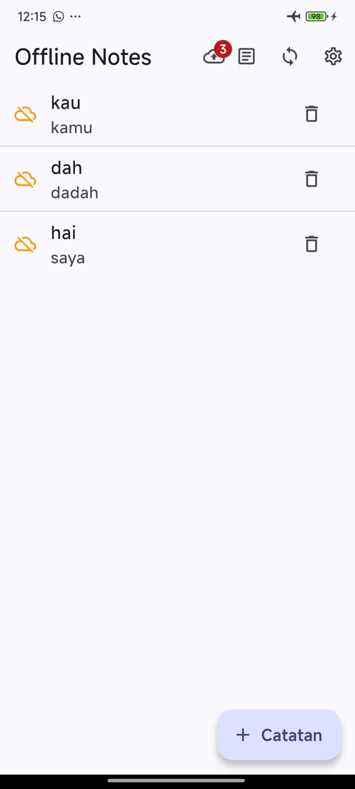

### Sebelum Sinkronisasi

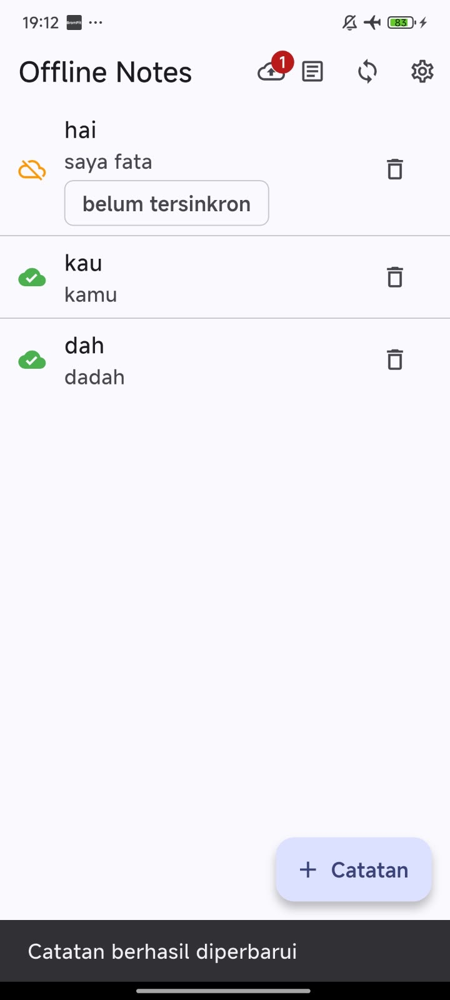

Sebelum sinkronisasi, catatan yang baru dibuat atau diubah masih memiliki status dirty sehingga badge menunjukkan adanya catatan yang menunggu sinkronisasi.

### Sinkronisasi Saat Paksa Offline

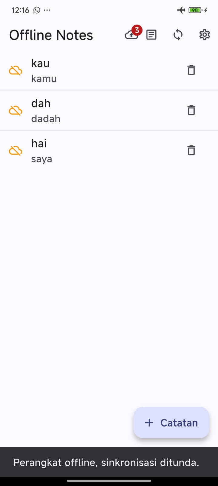

Ketika **Paksa mode offline** aktif, proses sinkronisasi ditolak dan catatan dirty tetap disimpan untuk dicoba kembali ketika online.

### Sinkronisasi Berhasil

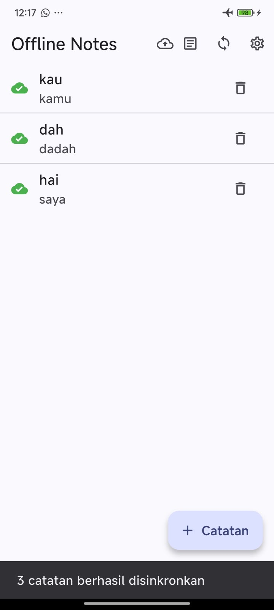

Setelah mode offline dimatikan, tombol sinkronisasi dapat digunakan kembali.

### Setelah Sinkronisasi


Setelah sinkronisasi berhasil, dirty flag dibersihkan dan indikator catatan berubah menjadi sudah tersinkron.

## 5.3 Cache-First Posts

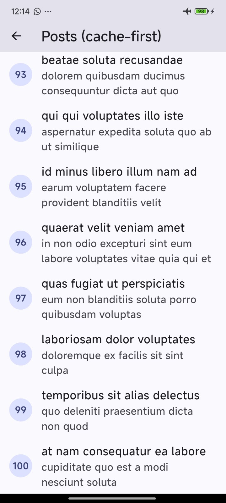

Pengujian Posts menunjukkan bahwa data yang telah diambil ketika online dapat dibaca kembali dari cache lokal. Pada implementasi `fetchAndCache()`, isi cache lama diganti dengan hasil API terbaru, sehingga refresh tidak menambah jumlah baris terus-menerus.

Pada pengujian awal saat online, endpoint Posts menghasilkan 100 data. Data tersebut kemudian disimpan ke tabel `cached_posts` dan dapat digunakan sebagai cache.

## 5.4 Tabel Uji Praktikum 4

| No | Skenario | Langkah Pengujian | Hasil Aktual | Status |
|---|---|---|---|---|
| 1 | Isi cache | Online lalu membuka Posts | Data Posts tampil dan tersimpan di cache | Lulus |
| 2 | Cache offline | Membuka Posts setelah cache tersedia | Posts tetap dapat ditampilkan dari cache | Lulus |
| 3 | Antrean dirty | Menambah 3 catatan | Badge dirty menunjukkan catatan yang menunggu sync | Lulus |
| 4 | Sync ditolak | Mengaktifkan Paksa mode offline lalu menekan Sync | Sinkronisasi ditolak dan dirty tetap ada | Lulus |
| 5 | Sync berhasil | Mematikan mode offline lalu menekan Sync | Catatan tersinkron dan badge dirty hilang | Lulus |
| 6 | Refresh background | Membuka Posts ketika online dan cache sudah tersedia | Cache tampil terlebih dahulu kemudian data diperbarui | Lulus |

## 5.5 Aturan Konflik

Aturan konflik yang digunakan adalah **Last-Write-Wins** berdasarkan `updatedAt`.

```text
Jika remote.updatedAt lebih baru → gunakan remote
Jika local.updatedAt lebih baru atau sama → gunakan local
```

Kelebihan aturan ini adalah sederhana dan deterministik. Kekurangannya adalah perubahan versi yang lebih lama dapat hilang dan mekanisme bergantung pada waktu perangkat.

## 5.6 Jawaban Pertanyaan Praktikum 4

### 1. Apa perbedaan cache-first dan network-first?

**Cache-first** membaca cache terlebih dahulu agar data dapat tampil dengan cepat, lalu melakukan refresh dari jaringan. Strategi ini sesuai untuk artikel atau katalog.

**Network-first** mencoba mengambil data terbaru dari jaringan terlebih dahulu dan menggunakan cache sebagai cadangan. Strategi ini lebih sesuai untuk data yang harus real-time seperti saldo, harga saham, atau stok.

### 2. Apa kelemahan `markAllSynced()`?

Jika sebuah catatan diedit lagi saat proses upload berlangsung, `markAllSynced()` dapat ikut menandai versi terbaru sebagai bersih walaupun versi tersebut belum dikirim. Perbaikannya adalah menandai catatan berdasarkan `id` dan `updated_at` yang benar-benar telah dikirim, atau menggunakan tabel outbox.

### 3. Mengapa perlu `forceOffline` jika sudah ada mode pesawat?

`forceOffline` membuat pengujian lebih konsisten dan deterministik. Demo tidak bergantung pada kondisi Wi-Fi atau jaringan perangkat dan dapat diuji secara otomatis.

### 4. Mengapa `fetchAndCache()` menggunakan transaksi?

Karena proses menghapus cache lama dan memasukkan data baru harus menjadi satu operasi atomik. Jika penyimpanan gagal di tengah proses, cache lama tidak menjadi setengah terhapus atau setengah terisi.

---

# 6. Praktikum 5 — Testing dengan Fake Repository

## 6.1 Tujuan

Testing dilakukan tanpa membuka SQLite asli. `FakeNoteRepository` digunakan untuk menguji model, provider, dan logika sinkronisasi secara cepat dan deterministik.

Test yang dijalankan mencakup:

- `Note.fromMap()`;
- serialisasi dirty flag;
- `notesProvider` kondisi sukses;
- `notesProvider` kondisi error;
- `syncNotes()` berhasil;
- `syncNotes()` ketika offline;
- `resolveConflict()`.

Pada provider error, retry otomatis Riverpod dinonaktifkan pada `ProviderContainer` agar test tidak mengalami timeout.

## 6.2 Hasil Aktual

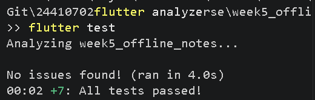

Hasil aktual:

```text
flutter analyze
No issues found!

flutter test
All tests passed!
```

Sebanyak **7 test** berhasil dijalankan.

## 6.3 Jawaban Pertanyaan Praktikum 5

### 1. Mengapa provider diuji menggunakan `ProviderContainer` dan `overrideWithValue`?

Cara ini memungkinkan provider diuji menggunakan repository palsu. Test menjadi lebih cepat, deterministik, dan tidak membutuhkan emulator, plugin, maupun SQLite asli.

### 2. Apa manfaat parameter `latency` pada `syncNotes()`?

Pada aplikasi, latency dapat digunakan untuk mensimulasikan proses upload. Pada testing, parameter dapat diisi `Duration.zero` sehingga test selesai lebih cepat.

### 3. Test tambahan apa yang penting?

Salah satu test tambahan yang penting adalah memastikan `updateNote()` membuat catatan kembali memiliki `dirty = true` serta memperbarui `updated_at`. Test ini penting karena catatan yang diubah harus masuk kembali ke antrean sinkronisasi.

---

# 7. AI Prompt Challenge

## 7.1 Link Percakapan AI

Hasil percakapan dengan AI:

https://chatgpt.com/c/6ac4dee4-d0e4-83ec-b18c-448515c7c5aa

### Bukti Implementasi AI

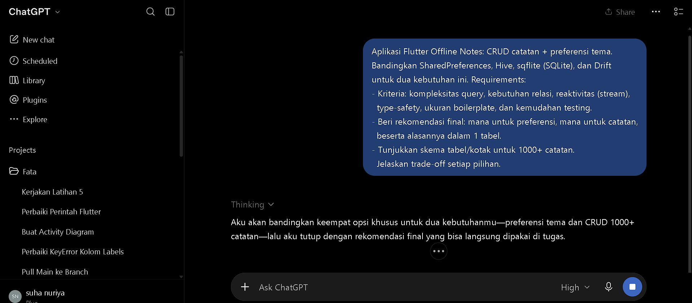

---

## 7.2 Prompt yang Digunakan

Prompt yang digunakan untuk meminta rekomendasi penyimpanan data adalah:

> Untuk aplikasi Flutter Offline Notes dengan kebutuhan CRUD catatan dan preferensi tema, bandingkan SharedPreferences, Hive, sqflite (SQLite), dan Drift.
>
> Perbandingan dilakukan berdasarkan:
>
> - kompleksitas query;
> - kebutuhan relasi;
> - reaktivitas atau stream;
> - type-safety;
> - ukuran boilerplate;
> - kemudahan testing.
>
> Berikan rekomendasi penyimpanan untuk preferensi tema dan data catatan, jelaskan trade-off setiap pilihan, serta berikan contoh skema penyimpanan yang sesuai untuk 1000+ catatan.

---

## 7.3 Hasil Awal AI

Berdasarkan hasil percakapan dengan AI, penyimpanan data direkomendasikan untuk dipisahkan berdasarkan karakteristik datanya.

AI memberikan rekomendasi:

```text
Preferensi Tema
      ↓
SharedPreferences

CRUD 1000+ Catatan
      ↓
     Drift
      ↓
    SQLite
```

Untuk preferensi tema, AI memilih **SharedPreferences** karena data tema hanya berupa key-value sederhana dan tidak membutuhkan query database yang kompleks.

Untuk catatan, AI memilih **Drift** karena Drift menggunakan SQLite tetapi menambahkan fitur seperti type-safe query, reactive stream, object mapping, migration tools, dan kemudahan testing menggunakan database in-memory.

AI menilai Drift lebih sesuai apabila aplikasi catatan berkembang menjadi memiliki fitur:

- sorting;
- filtering;
- pencarian;
- pin catatan;
- tag;
- kategori;
- relasi antar data;
- reactive list.

---

## 7.4 Perbandingan Storage Berdasarkan Hasil AI

| Penyimpanan | Kompleksitas Query | Relasi | Reaktivitas / Stream | Type-safety | Boilerplate | Testing | Cocok untuk Kasus Ini |
|---|---|---|---|---|---|---|---|
| **SharedPreferences** | Sangat sederhana, hanya key-value | Tidak mendukung relasi | Tidak ditujukan untuk query stream database | Cukup aman untuk tipe sederhana | Sangat sedikit | Mudah untuk data sederhana | Sangat cocok untuk tema, tidak cocok untuk 1000+ catatan |
| **Hive** | Mudah untuk CRUD berdasarkan key, tetapi filtering dan sorting kompleks lebih manual | Terbatas | Mendukung perubahan melalui `watch()` | Cukup baik dengan typed box dan TypeAdapter | Sedikit–sedang | Relatif mudah | Bisa untuk catatan sederhana |
| **sqflite / SQLite** | Sangat fleksibel menggunakan SQL seperti `WHERE`, `ORDER BY`, `JOIN`, dan index | Sangat baik | Tidak menyediakan reactive query otomatis | Mapping model dilakukan manual | Cukup banyak | Perlu setup repository/database untuk testing | Bagus untuk catatan |
| **Drift** | Mendukung SQL dan Dart query API | Sangat baik | Mendukung query reactive melalui `watch()` | Sangat kuat karena query dan hasil dicek saat compile time | Paling banyak karena code generation | Sangat baik dan dapat memakai database in-memory | Pilihan utama AI untuk catatan |

---

## 7.5 Rekomendasi Awal AI

### SharedPreferences untuk Preferensi Tema

AI merekomendasikan SharedPreferences untuk menyimpan data seperti:

```text
theme_mode = dark
```

Contoh struktur sederhananya:

```text
┌──────────────────────────────┐
│       SharedPreferences      │
├──────────────────────────────┤
│ key          │ value         │
├──────────────┼───────────────┤
│ theme_mode   │ "dark"        │
└──────────────┴───────────────┘
```

SharedPreferences dianggap sesuai karena data preferensi hanya membutuhkan penyimpanan sederhana dan tidak membutuhkan tabel, relasi, sorting, filtering, maupun query database.

---

### Drift untuk Catatan

Untuk 1000+ catatan, AI tidak merekomendasikan menyimpan seluruh data menggunakan SharedPreferences.

AI memberikan contoh struktur data menggunakan Drift/SQLite seperti berikut:

```text
              DRIFT / SQLITE
┌──────────────────────────────────────────────┐
│                    NOTES                     │
├──────────────┬───────────────┬───────────────┤
│ id           │ INTEGER       │ PRIMARY KEY   │
│ title        │ TEXT          │ NOT NULL      │
│ content      │ TEXT          │ NOT NULL      │
│ created_at   │ DATETIME      │ NOT NULL      │
│ updated_at   │ DATETIME      │ NOT NULL      │
│ is_pinned    │ BOOLEAN       │ DEFAULT false │
└──────────────┴───────────────┴───────────────┘
                         │
                         │ INDEX
                         ▼
              ┌────────────────────┐
              │ updated_at         │
              │ is_pinned          │
              └────────────────────┘

                   1000+ rows
```

Contoh struktur Drift yang diberikan AI secara konsep:

```dart
class Notes extends Table {
  IntColumn get id => integer().autoIncrement()();

  TextColumn get title => text()();

  TextColumn get content => text()();

  DateTimeColumn get createdAt => dateTime()();

  DateTimeColumn get updatedAt => dateTime()();

  BoolColumn get isPinned =>
      boolean().withDefault(const Constant(false))();
}
```

Dengan struktur tersebut, operasi catatan dapat dilakukan seperti:

```text
Tambah catatan
      ↓
INSERT notes

Edit catatan
      ↓
UPDATE notes WHERE id = ?

Hapus catatan
      ↓
DELETE notes WHERE id = ?

Daftar catatan
      ↓
ORDER BY is_pinned DESC, updated_at DESC

Cari catatan
      ↓
WHERE title LIKE ? OR content LIKE ?
```

AI juga memberikan contoh reactive query Drift:

```dart
Stream<List<Note>> watchNotes() {
  return (select(notes)
        ..orderBy([
          (n) => OrderingTerm.desc(n.isPinned),
          (n) => OrderingTerm.desc(n.updatedAt),
        ]))
      .watch();
}
```

Dengan pendekatan tersebut, perubahan pada database dapat langsung menghasilkan data terbaru melalui stream.

---

## 7.6 Trade-Off Setiap Pilihan Berdasarkan Hasil AI

### SharedPreferences

Kelebihan:

- implementasi sangat sederhana;
- cocok untuk key-value;
- boilerplate sangat sedikit;
- mudah digunakan untuk data seperti tema.

Kekurangan:

- tidak mendukung tabel;
- tidak mendukung relasi;
- tidak cocok untuk query;
- tidak cocok untuk sorting dan filtering;
- tidak sesuai untuk menyimpan 1000+ catatan.

Kesimpulan AI:

```text
SharedPreferences
→ Cocok untuk preferensi tema
```

---

### Hive

Kelebihan:

- ringan;
- CRUD sederhana;
- penyimpanan berbasis key;
- dapat menyimpan objek dengan TypeAdapter;
- mendukung perubahan melalui `watch()`.

Kekurangan:

- filtering dan sorting kompleks lebih banyak dilakukan secara manual;
- kurang ideal jika aplikasi berkembang menjadi memiliki banyak query dan relasi.

Kesimpulan AI:

```text
Hive
→ Bisa digunakan untuk aplikasi notes sederhana
→ Kurang ideal jika kebutuhan query berkembang
```

---

### sqflite / SQLite

Kelebihan:

- menggunakan SQLite secara langsung;
- mendukung query SQL;
- mendukung `WHERE`, `ORDER BY`, `JOIN`, dan index;
- cocok untuk data dalam jumlah besar;
- mendukung transaction dan batch.

Kekurangan:

- mapping antara hasil query dan model Dart dilakukan secara manual;
- developer harus menulis SQL;
- tidak memiliki reactive query otomatis;
- mekanisme refresh UI harus dikelola sendiri.

Kesimpulan AI:

```text
sqflite
→ Bagus untuk data catatan
→ Lebih manual dibanding Drift
```

---

### Drift

Kelebihan:

- tetap menggunakan SQLite;
- query type-safe;
- mendukung relasi;
- mendukung migration;
- mendukung reactive query melalui `watch()`;
- object mapping lebih terstruktur;
- mudah diuji dengan database in-memory.

Kekurangan:

- setup lebih banyak;
- membutuhkan code generation;
- boilerplate lebih besar;
- dapat terasa berlebihan untuk aplikasi yang sangat sederhana.

Kesimpulan AI:

```text
Drift
→ Pilihan utama AI untuk data catatan
→ Cocok jika aplikasi berkembang
```

---

## 7.7 Kesimpulan Awal dari AI

Kesimpulan final yang diberikan AI adalah:

```text
Flutter Offline Notes
        │
        ├── Preferensi Tema
        │       ↓
        │  SharedPreferences
        │
        └── CRUD 1000+ Catatan
                ↓
              Drift
                ↓
              SQLite
```

Menurut AI, kombinasi:

```text
SharedPreferences + Drift
```

merupakan pilihan yang paling seimbang apabila aplikasi Offline Notes diperkirakan berkembang dan membutuhkan query yang lebih kompleks, reactive stream, relasi, serta type-safety.

---

# 8. Verifikasi Hasil AI

Rekomendasi AI tidak langsung digunakan seluruhnya pada project.

Hasil rekomendasi dibandingkan kembali dengan kebutuhan praktikum dan implementasi aktual aplikasi.

---

## 8.1 Verifikasi SharedPreferences

Rekomendasi AI untuk menggunakan SharedPreferences pada preferensi tema **diterima**.

Pada aplikasi yang dibuat, SharedPreferences digunakan untuk:

- menyimpan tema terang/gelap;
- menyimpan waktu terakhir aplikasi dibuka.

Data tersebut hanya berupa data sederhana sehingga SharedPreferences sudah sesuai dengan kebutuhan.

Keputusan:

```text
Preferensi
     ↓
SharedPreferences
     ↓
DITERIMA
```

---

## 8.2 Verifikasi Drift

AI merekomendasikan Drift untuk data catatan karena memiliki:

- type-safe query;
- reactive stream;
- dukungan relasi;
- object mapping;
- kemudahan testing;
- dukungan data dalam jumlah besar.

Namun rekomendasi tersebut **tidak diterapkan pada project ini**.

Project tetap menggunakan:

```text
sqflite / SQLite
```

Alasannya:

1. Project praktikum sudah dibangun menggunakan `sqflite`.
2. `sqflite` sudah memenuhi kebutuhan CRUD catatan.
3. Data dapat diurutkan berdasarkan `updated_at`.
4. Catatan dapat dicari berdasarkan `id`.
5. Field `dirty` dapat digunakan untuk mengetahui catatan yang belum tersinkron.
6. Field `updated_at` dapat digunakan untuk aturan konflik.
7. Riverpod sudah digunakan untuk melakukan refresh state UI.
8. Mengganti sqflite menjadi Drift akan menambah dependency dan perubahan arsitektur yang tidak diperlukan untuk kebutuhan mini project ini.

Keputusan:

```text
Rekomendasi AI
     ↓
   Drift
     ↓
Tidak digunakan

Implementasi Project
     ↓
sqflite / SQLite
```

---

## 8.3 Perbedaan Skema AI dan Skema Project

Skema yang disarankan AI:

```text
NOTES
├── id
├── title
├── content
├── created_at
├── updated_at
└── is_pinned
```

Sedangkan skema aktual project adalah:

```text
NOTES
├── id
├── title
├── body
├── updated_at
└── dirty
```

Skema project memiliki field `dirty` karena project berfokus pada mekanisme **offline-first dan sinkronisasi**.

`dirty` digunakan untuk menandai catatan yang belum disinkronkan.

```text
dirty = 1
→ belum tersinkron

dirty = 0
→ sudah tersinkron
```

Sedangkan `updated_at` digunakan untuk:

- pengurutan catatan;
- mengetahui perubahan terakhir;
- membantu aturan konflik Last-Write-Wins.

---

## 8.4 Tabel Perbandingan Hasil AI dan Implementasi Aktual

| Bagian | Rekomendasi AI | Implementasi Aktual | Keputusan |
|---|---|---|---|
| Preferensi tema | SharedPreferences | SharedPreferences | Diterima |
| Waktu terakhir dibuka | SharedPreferences sesuai untuk key-value sederhana | SharedPreferences | Diterapkan |
| Database catatan | Drift | sqflite / SQLite | Rekomendasi AI tidak digunakan |
| Reactive data | Drift `watch()` | Riverpod + invalidate provider | Mengikuti arsitektur praktikum |
| Model database | Type-safe melalui Drift | Mapping manual Note ↔ Map | Tetap menggunakan sqflite |
| Offline-first | Dapat dikembangkan | `dirty`, `updated_at`, dan `syncNotes()` | Diimplementasikan langsung |
| Konflik data | Tidak menjadi fokus utama pada rekomendasi awal | Last-Write-Wins | Mengikuti kebutuhan praktikum |

---

# 9. Keputusan Final Setelah Verifikasi AI

Setelah membandingkan rekomendasi AI dengan kebutuhan project, keputusan akhir yang digunakan adalah:

```text
Flutter Offline Notes
        │
        ├── Preferensi
        │       ↓
        │ SharedPreferences
        │
        └── Catatan
                ↓
         sqflite / SQLite
```

### SharedPreferences

Digunakan untuk:

- tema gelap/terang;
- waktu terakhir aplikasi dibuka.

Alasan:

- data sederhana;
- berbentuk key-value;
- tidak membutuhkan query database.

### sqflite / SQLite

Digunakan untuk:

- menambah catatan;
- membaca catatan;
- memperbarui catatan;
- menghapus catatan;
- mengurutkan catatan;
- membaca catatan berdasarkan ID;
- menyimpan `updated_at`;
- menyimpan dirty flag;
- mendukung proses sinkronisasi.

---

## 9.1 Alasan Keputusan Final

Walaupun AI merekomendasikan Drift untuk catatan, project tetap menggunakan sqflite karena fitur Drift yang lebih kompleks belum dibutuhkan pada project ini.

sqflite sudah dapat memenuhi kebutuhan:

```text
CRUD
+
SQLite
+
updated_at
+
dirty flag
+
offline-first
+
sinkronisasi
+
Last-Write-Wins
```

Drift akan lebih menarik apabila aplikasi dikembangkan lebih lanjut dengan fitur seperti:

- pencarian kompleks;
- banyak filter;
- kategori;
- tag;
- relasi antar tabel;
- reactive query;
- kebutuhan type-safety database yang lebih tinggi.

Untuk kebutuhan Praktikum Minggu 5 dan Mini Project Offline Notes, kombinasi yang digunakan adalah:

```text
SharedPreferences + sqflite
```

Keputusan ini berbeda dengan rekomendasi awal AI:

```text
SharedPreferences + Drift
```

Perbedaan tersebut merupakan hasil verifikasi terhadap kebutuhan aktual project, sehingga rekomendasi AI tidak digunakan secara langsung tanpa evaluasi.

## 9.2 Ubah Catatan dari Detail

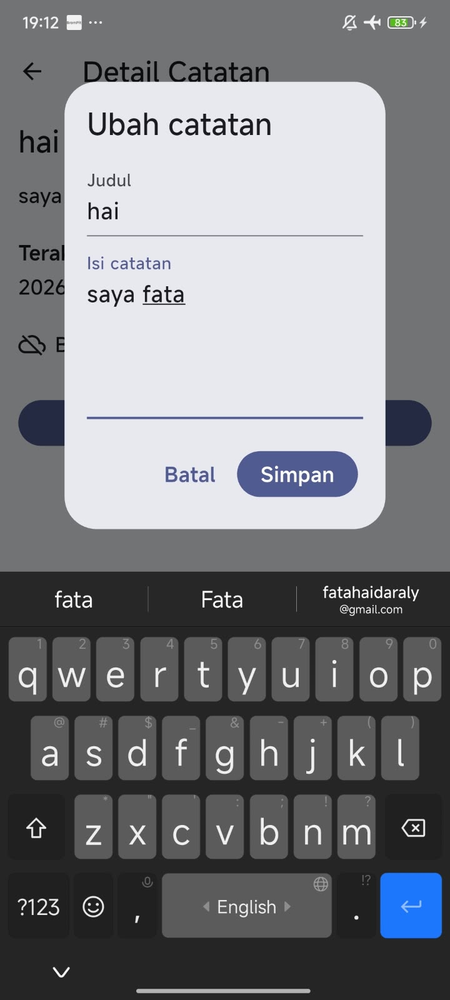

Dari halaman detail, catatan dapat dibuka kembali pada form edit. Setelah disimpan, data pada SQLite diperbarui dan status catatan kembali menjadi dirty karena perubahan terbaru belum disinkronkan.

## 9.3 Struktur Project

```text
week5_offline_notes/
├── lib/
│   ├── data/
│   │   ├── local/
│   │   ├── remote/
│   │   ├── repositories/
│   │   └── sync.dart
│   ├── pages/
│   │   ├── notes_page.dart
│   │   ├── note_detail_page.dart
│   │   ├── posts_page.dart
│   │   └── setting_page.dart
│   ├── providers/
│   ├── widgets/
│   └── main.dart
├── test/
│   └── note_test.dart
├── docs/
├── screenshots/
└── README.md
```

---

# 10. Refleksi

## 1. Mengapa daftar catatan tidak boleh disimpan di SharedPreferences?

SharedPreferences cocok untuk nilai kecil dan sederhana. Jika seluruh catatan disimpan di sana, pengelolaan CRUD, pencarian berdasarkan ID, pengurutan, dirty flag, dan perubahan sebagian data menjadi lebih rumit dan rapuh. SQLite lebih cocok karena menyimpan setiap catatan sebagai baris terpisah.

## 2. Kapan cache-first cukup dan kapan network-first diperlukan?

Cache-first cukup ketika aplikasi dapat menampilkan data yang sedikit lebih lama, misalnya artikel dan katalog. Network-first lebih tepat untuk data yang harus selalu terbaru, seperti saldo, stok, atau harga real-time.

## 3. Bagaimana dirty flag menjadi antrean sync tanpa memblokir UI?

Ketika catatan dibuat atau diubah, aplikasi langsung menyimpannya ke SQLite dengan `dirty = true`. UI dapat langsung menampilkan hasil tanpa menunggu server. Saat online, catatan dirty diproses dalam sinkronisasi. Untuk sistem yang lebih kompleks, tabel outbox dapat digunakan untuk mencatat operasi yang harus dikirim ke server.

## 4. Bagian rekomendasi AI mana yang ditolak?

Rekomendasi yang menempatkan koleksi catatan di SharedPreferences ditolak karena tidak sesuai untuk pengelolaan data terstruktur dalam jumlah banyak. Aplikasi memilih SharedPreferences hanya untuk preferensi dan SQLite untuk data catatan.

---

# 11. Kesimpulan

Pada Praktikum Minggu 5, aplikasi **Offline Notes** berhasil dikembangkan dengan pendekatan local storage dan offline-first. SharedPreferences digunakan untuk preferensi sederhana, sedangkan SQLite digunakan untuk catatan yang membutuhkan CRUD dan query. Riverpod memisahkan state UI dari akses data, sementara dirty flag dan `syncNotes()` memungkinkan perubahan lokal tetap dilakukan tanpa internet dan disinkronkan kembali ketika online. Cache-first membuat data Posts tetap dapat digunakan dari cache, sedangkan testing dengan repository palsu memastikan logika aplikasi dapat diuji tanpa database sungguhan. Setelah refactoring, aplikasi juga memiliki pemisahan tanggung jawab yang lebih jelas serta halaman detail berbasis GoRouter.

---

# 12. Daftar File Screenshot yang Digunakan

| No | File | Format |
|---|---|---|
| 1 | `screenshots/p1-tema-gelap.jpeg` | JPEG |
| 2 | `screenshots/p1-tema-terang.jpeg` | JPEG |
| 3 | `screenshots/p3-tambah-catatan.jpeg` | JPEG |
| 4 | `screenshots/p3-ubah-catatan.jpeg` | JPEG |
| 5 | `screenshots/p3-delete-notes.jpeg` | JPEG |
| 6 | `screenshots/p4-menambahkan-3notes.jpeg` | JPEG |
| 7 | `screenshots/sebelumsync-setelahdiubah.jpeg` | JPEG |
| 8 | `screenshots/p4-sync-paksaoffline.jpeg` | JPEG |
| 9 | `screenshots/p4-sync.jpeg` | JPEG |
| 10 | `screenshots/setelah-sync.jpeg` | JPEG |
| 11 | `screenshots/p4-posts-cache.jpeg` | JPEG |
| 12 | `screenshots/p5.png` | PNG |
| 13 | `screenshots/implementasi-ai.png` | PNG |
| 14 | `screenshots/detail-catatan.jpeg` | JPEG |
| 15 | `screenshots/ubah-catatan.jpeg` | JPEG |

> Nama dan ekstensi gambar pada laporan mengikuti file yang tersedia pada folder `screenshots`.
